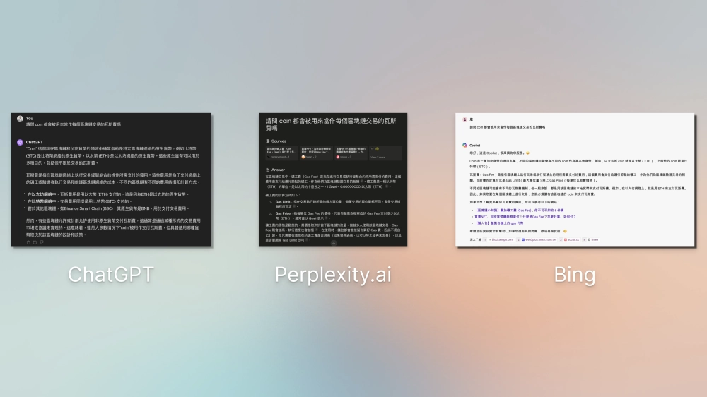
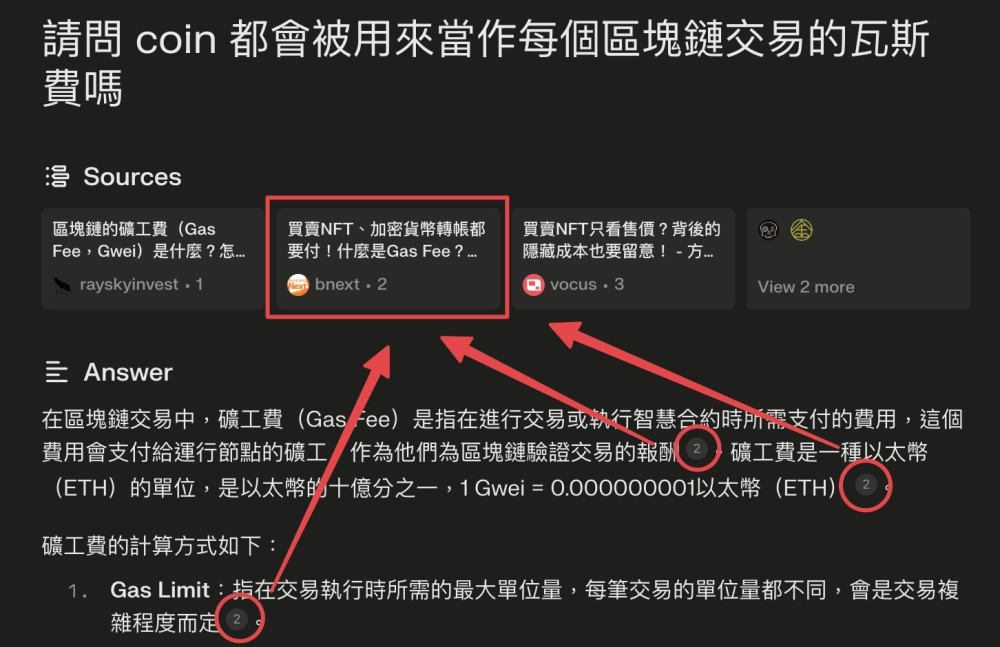
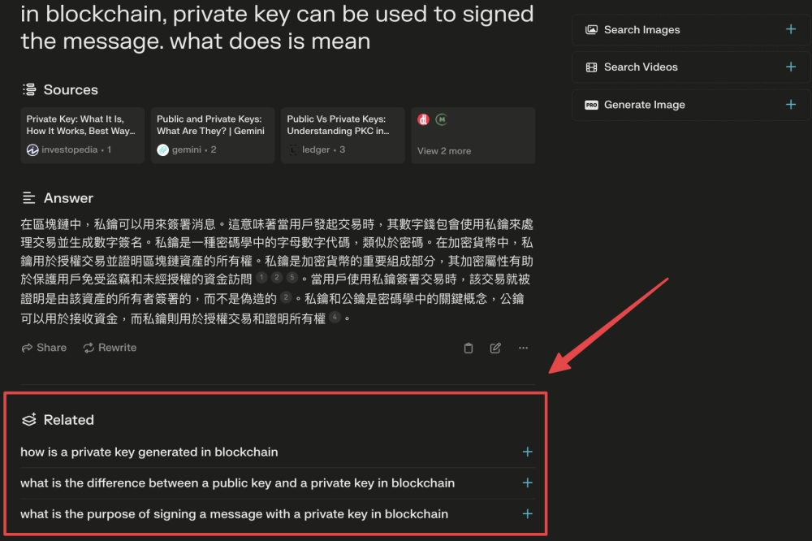
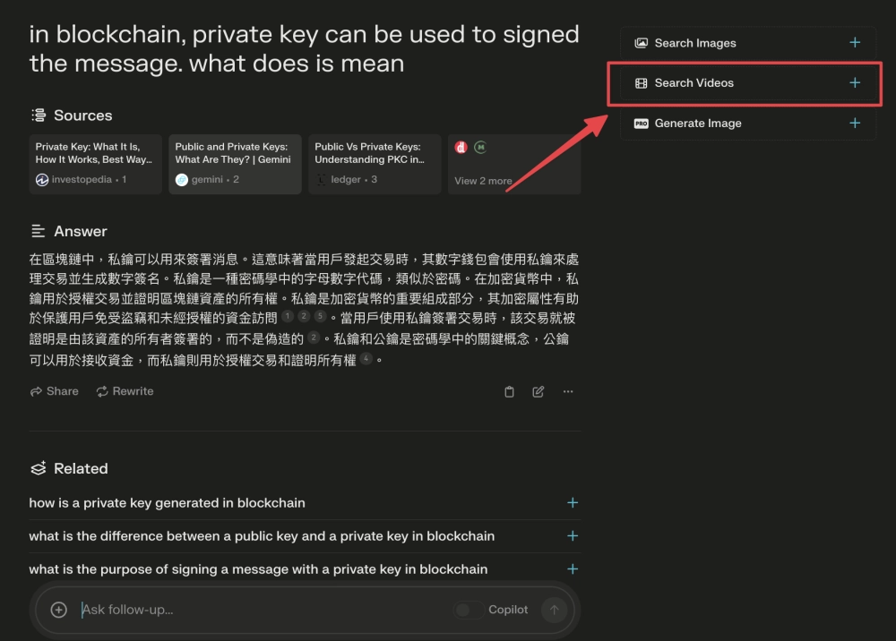
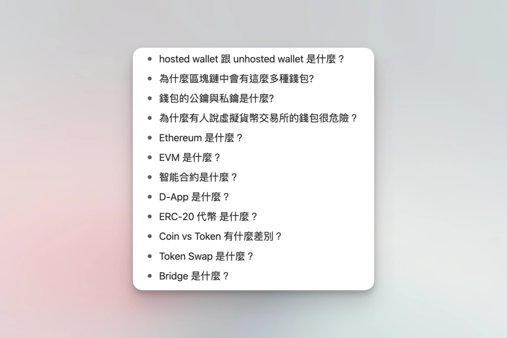
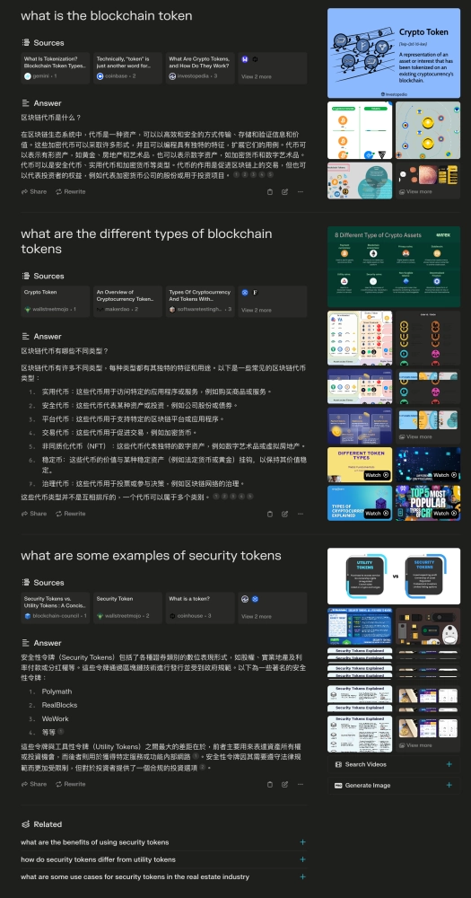
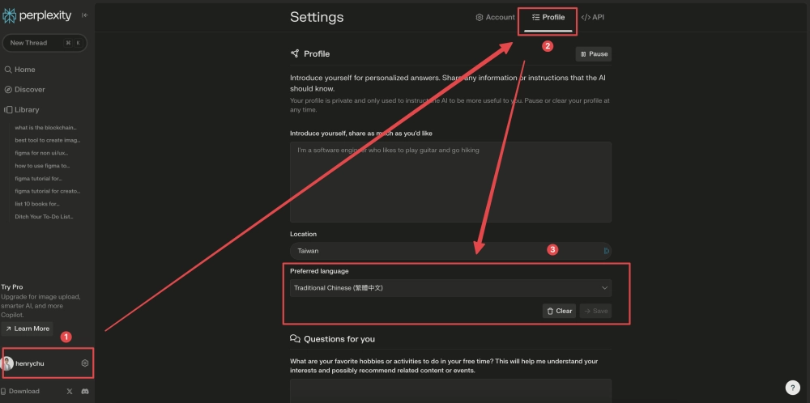
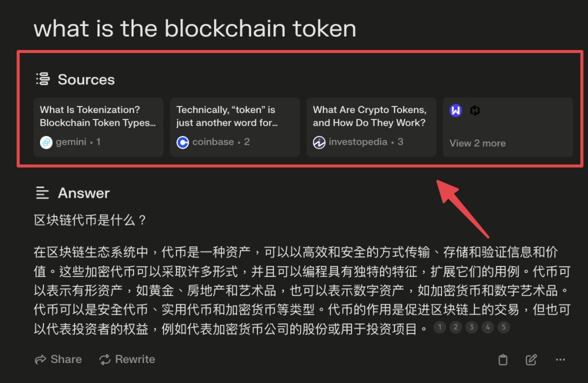
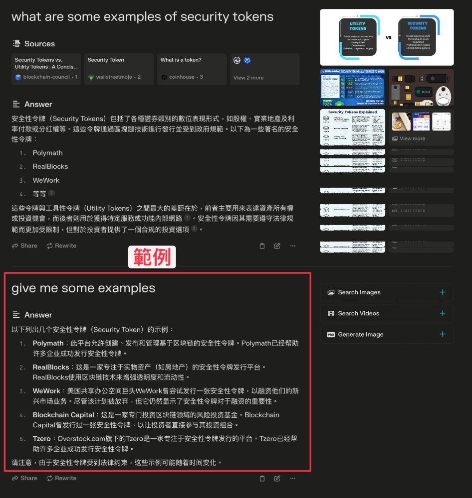

# 需要做研究报告和简报的职场人，这个AI工具能帮你省下一半资料整理时间

你有没有遇到过这种情况：老板突然让你做一份陌生领域的简报，网上资料一大堆，看了半天还是云里雾里。

我就碰到过。

那次公司让我给业务团队做区块链基础知识培训。问题是，区块链这玩意儿概念套概念——你得先懂区块链，才能理解以太坊；懂了以太坊，才能搞清楚EVM是啥；搞清楚EVM，才能往下讲智能合约、D-App这些东西。

一层压一层，哪层没搞懂，后面就卡死。

---

后来朋友给我推荐了Perplexity.ai。

这东西一开始我也没当回事，心想："不就是个AI搜索工具吗？ChatGPT和Bing不也能干这个？"

用了之后才发现，还真不一样。

## Perplexity.ai到底好在哪

### 答案不是应付你

同一个问题，扔给ChatGPT、Bing和Perplexity.ai，得到的答案质量差很多。

ChatGPT和Bing基本只给你名词解释，像是从百科复制粘贴的。但Perplexity.ai会先解释概念，然后给实际案例，看完你就知道这东西到底怎么用。

如果你在准备重要材料，担心信息准确性和完整度，👉 [这个专业版账号支持更深度的研究查询，覆盖学术、商业等多个领域，365天质保让你用得安心](https://shaoyumi.com/buy/64)。

### 每个答案都带来源

这点特别关键。

Perplexity.ai每次给答案，下面都会标注资料从哪来的。你想深挖某个点，直接点链接就能看原文。

做研究报告最怕的就是老板问："这数据哪来的？"——有了来源，你心里有底。

### 速度是真的快

输入问题，按回车，答案直接出来。没有ChatGPT那种"正在思考中..."的等待，也没有Bing搜索后还要你自己点网页看。

就这个速度，赶deadline的时候能救命。

### 会推荐你接下来可能要问的

这个功能我特别喜欢。

每次搜索完，Perplexity.ai会根据你问的问题，自动推荐3个相关问题。有时候你自己都没想到要查这个，它就给你列出来了。

做研究最怕思路断掉，这功能就像是有个人在旁边提醒你："诶，这个方向你也可以看看。"

### 文字看不懂？还能搜视频

搜索结果右边有个"Search Video"按钮，点下去就能看相关的YouTube视频。

有些复杂概念，看文字真的不如看视频来得快。一个页面把文字、来源、视频全包了，不用来回切换标签页。

---

## 我是怎么用它做出简报的

说回我那次区块链简报的任务。

整个流程其实就5步，但确实管用。

### 第一步：把不懂的都列出来

一开始我对区块链也是似懂非懂。

但做简报最怕的就是自己没搞清楚——你都搞不明白，怎么教别人？

所以我把所有有疑问的地方都列成问题：
- hosted wallet和unhosted wallet是什么？
- 公钥是什么？
- 私钥又是什么？

一条条打在笔记软件里。

别嫌麻烦，这步做好了，后面省事。

### 第二步：用英文提问

看着清单，一个个问题丢给Perplexity.ai。

这里有个小技巧：**用英文问**。

尤其是冷门或技术类的东西，英文资料比中文多太多了。区块链这种玩意儿，中文资料又少又乱，英文资料又多又全。

如果想深挖某个点,直接点下面推荐的问题继续问。

### 第三步：看中文答案

你可能会担心："我英文不太好，答案看得懂吗?"

这就是Perplexity.ai最妙的地方了。

先去`Settings` > `Profile` > `Preferred Language`调成"Traditional Chinese(繁体中文)"。

然后你用英文问，它会把英文资料自动翻成中文给你，还会总结成人话。同时保留英文来源链接，你想看原文随时能看。

有些概念光看文字还是晕？点右边"Search Videos"，YouTube视频直接出来。

### 第四步：把答案搬进简报

问题都搞清楚了，做简报就快了。

但做到一半我又发现，光有理论不够，得有实际案例才能让内容站得住。

以前遇到这种情况，得去Google搜"{关键词} 案例"，然后点开一堆网页慢慢找。

现在直接在Perplexity.ai输入`give me some examples`，两秒钟，案例列表就出来了。

把案例加进简报，整个内容立马变扎实。

### 第五步：重复前面的步骤

剩下的就简单了：
- 看着问题清单
- 逐个问Perplexity.ai  
- 把答案整理进简报
- 需要案例就追问`give me some examples`

循环几轮，简报就做完了。

---

## 第一次觉得收集资料这么爽

说实话，这是我第一次觉得收集资料可以这么流畅。

以前做研究，总觉得自己像个没头苍蝇——搜索、点链接、看网页、做笔记，来回折腾。

用Perplexity.ai之后，整个节奏变了：
- 问问题
- 看答案
- 追问
- 再看答案

就这么简单。信息像水流一样，一直往前推着你走。你不会卡住，不会断片，就是一直在往前。

如果你工作中需要：
- 准备行业研究报告
- 做产品分析简报
- 写技术文档
- 学习新领域知识

👉 [试试Perplexity Pro年费成品号，比免费版搜索更精准，支持更复杂的查询，24小时自动发货](https://shaoyumi.com/buy/64)。你会发现，原来收集资料可以不用那么痛苦。
